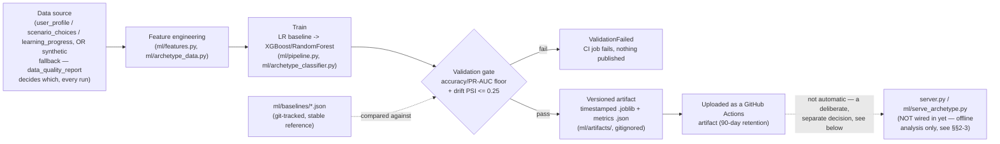

# ML/Agentic Engineering — Progress Notes

Tracks the PRD's four items against what's actually built, so the write-up
never outruns the work (per the PRD's own guardrail). Updated as each item
lands.

## 1. Agentic Coaching Chat — done

- **Tool set implemented**: `get_my_profile`, `get_my_recent_decisions`,
  `get_my_axis_consistency`, `get_my_goals`, `search_research_notes` (RAG).
  All in `coach_agent.py`, closed over the authenticated request's `user_id`.
- **Deliberate deviation from the spec**: safeguarding is *not* a callable
  tool, even though the PRD's initial tool list includes it. PAPER.md §7.7
  requires crisis detection to "never fail closed" — an LLM agent can
  simply choose not to call a tool on a given turn, which is exactly the
  failure mode that requirement rules out. Safeguarding stays a
  deterministic Python check in `server.py` that runs before either engine
  (direct or agent) and is threaded into the reply the same way for both.
  This is a stronger design than the spec asked for, not a shortcut — call
  it out this way if it comes up.
- **Model decides tool use from conversation context**, via
  `langchain.agents.create_agent` (LangChain 1.x, built on LangGraph) — not
  a hardcoded call sequence. `demo_agent_trace.py` produces a real, runnable
  trace of this (script below).
- **Every tool call is logged and queryable**: `agent_tool_calls` table
  (`db.py`), written by `coach_agent.ToolCallLogger` (a LangChain callback
  handler, not per-tool edits — logging can't drift out of sync as tools
  are added). Queryable via `GET /api/admin/agent-tool-calls` (admin-gated)
  or `db.get_recent_agent_tool_calls()`.
- **Graceful degradation, verified two ways**: (a) each tool wraps its own
  DB call in try/except — a direct test confirmed an unhandled tool
  exception propagates out of `agent.invoke()` and would otherwise end the
  conversation; (b) the whole agent path falls back to `AgentUnavailable`
  → the same 503 path as the direct engine, if langchain isn't installed,
  the API key is missing, or the model call itself fails.
- **Single-agent only** — no multi-agent orchestration, per the PRD's own
  guardrail.

**Interview evidence**: `python demo_agent_trace.py` — real `create_agent`
graph, real tool execution against a real seeded user, real row written to
`agent_tool_calls`, printed at the end. The model's decision to call a tool
is scripted (the real `ANTHROPIC_API_KEY` is currently tied to a disabled
org — see git history), but everything downstream of that decision is real
and unmodified from the production code path. Swapping in a working key
requires no code changes to this script.

**LangSmith tracing** (`coach_agent.tracing_enabled()`, opt-in via
`LANGSMITH_TRACING=true` + `LANGSMITH_API_KEY`) — every `agent.invoke()`
call is tagged with a run name (`coach-{persona}`), tags (persona,
chat-mode vs. decision-mode), and metadata (signed-in, has-scenario)
unconditionally, whether or not tracing is actually on, so there's no
separate "remember to add tracing metadata" step once a real LangSmith key
exists. `GET /api/chat-info` reports whether it's currently active.
Verified directly that a bad/expired key degrades safely: LangSmith logs a
background "Failed to multipart ingest runs" warning to stderr and the
actual coaching reply comes through unaffected — tracing failures can't
break the product, so this needed no `AgentUnavailable`-style gating.

Tests: `tests/test_chat_agent.py` (28 tests — tool logic, logging, graceful
degradation, admin endpoint, recursion limit), `tests/test_rag.py` (6 tests
— retrieval).

### Deploy-readiness — closed 3 of the 6 blockers identified when asked
"what's preventing this from being production ready":

1. ~~Dead `ANTHROPIC_API_KEY`~~ — **not fixable from here**, still open.
   The org tied to the leaked key is disabled; needs manual resolution at
   console.anthropic.com, then the new key set in Railway's env vars.
2. ~~`requirements-agent.txt` never installed on Railway~~ — **fixed**.
   `nixpacks.toml`'s install phase now installs both requirement files, so
   `LLM_ENGINE=agent` can be turned on via a Railway env var alone, no
   redeploy needed to add the dependency. Tradeoff: larger image / slower
   build even while the agent engine stays off, documented inline.
3. ~~RAG index has no production home~~ — **fixed**. Restructured the
   build so it no longer needs Node at deploy time: `rag/build_corpus.js`
   is now a dev-time step whose output (`rag/corpus_js.json`) is committed
   to git, and `rag/build_index.py` reads that committed snapshot rather
   than shelling out to Node. `nixpacks.toml`'s build phase runs
   `python -m rag.build_index`, baking the index (and the embedding
   model's one-time download) into the deployed image instead of a live
   request's cold start.
4. ~~Never tested against the real model~~ — **still open**, blocked on
   (1). `demo_agent_trace.py` proves everything downstream of the model's
   tool-call decision; the decision itself needs a real key to verify.
5. ~~No bound on the tool-calling loop~~ — **fixed**. `agent.invoke()` now
   sets an explicit `recursion_limit` (`AGENT_RECURSION_LIMIT` env var,
   default 15 — roughly 5-7 tool calls' worth of headroom). Verified two
   ways: a real `GraphRecursionError` from an intentionally-looping fake
   model gets caught by the existing `AgentUnavailable` handling, and a
   mocked `create_agent` confirms the configured limit is what actually
   reaches `.invoke()`, not just a defined-but-unused constant.
6. No monitoring beyond `app.logger.warning()` — **still open**, not
   started. Lowest priority of the six; nothing to alert on until (1)/(4)
   land and the agent engine is actually live for real traffic.

None of 2/3/5 have been verified against a real Railway deploy — I don't
have deploy access. They're correct as far as local testing can confirm
(nixpacks.toml's syntax, `rag.build_index` running clean, the recursion
limit actually reaching `.invoke()`); treat the next real Railway deploy as
the first real verification of the build config specifically.

## 2. Predictive Models on Product Data — done

### Targets, defined precisely

- **Pro conversion likelihood** — binary (`converted`). 1 if the user has
  ever had a `subscriptions` row at all (not filtered to `status=active`
  — the question is "did early behaviour predict them subscribing," not
  "are they still paying today," which is a different question). Features
  computed from their first 7 days after signup.
- **Streak drop-off** — binary (`dropped_off`), **not** the PRD's
  time-to-event option. 1 if it's been >5 days since `lastActivityDate`,
  among users who ever reached a 2-day streak (someone who never started
  doesn't have a "drop-off" to predict). See "what's available vs. missing"
  below for why time-to-event isn't honestly derivable from what's stored.

### What's available vs. what needs new instrumentation (`ml/features.py`)

The only table with real per-event, per-user **timestamps** is
`scenario_choices` — that's the entire basis for "early-window behavioral
signals." `learning_progress`, `achievements`, and `user_profile` are each
a single overwrite-in-place row per user (`user_id PRIMARY KEY`, one JSON
blob, `updated_at` = last write, not first) — there is no way to
reconstruct "state as of day 7" from them, only "state right now." This is
exactly why streak drop-off is a snapshot-based proxy, not a true
time-to-event model: there's no streak *history* stored, only the current
value. `classroom_plays` has no `user_id` column at all (anonymous by
design), so it can't be joined to an outcome under the current schema.
Fixing this for real would mean either periodic snapshotting of the
snapshot tables or turning them into append-only event logs the way
`scenario_choices` already is.

### Data quality check — real data isn't trainable yet, and the code says so

Pulling the real features and checking them (`ml.features.data_quality_report`,
which checks class balance **and** what fraction of the underlying accounts
are `@example.com` pytest-fixture users, not just row count):

- Conversion: n=2,369, class counts `{0: 2157, 1: 212}` — passes on row
  count alone, but **99.96% of those users are test-fixture accounts**
  accumulated across pytest runs, not real signups. Flagged unusable.
- Streak drop-off: only **1** user in the whole database has ever reached
  a 2-day learning streak. Flagged unusable on row count alone.

Training "the" model on either would produce a number that looks like a
real result but isn't one. Both training scripts print this check and the
reason, every run — it's never silently skipped.

### Pipeline validated against synthetic data with a known ground truth instead

`ml/synthetic.py` generates a dataset per target with a **designed,
documented** feature→target relationship (exact coefficients in the
module, not hidden), so `ml/pipeline.py` (stratified split, logistic-
regression baseline, XGBoost, evaluated on precision/recall/PR-AUC/ROC-AUC
— not raw accuracy, since both targets are imbalanced by construction:
15% / 7% positive rates) can be built and proven correct independent of
whether real volume exists yet. `python -m ml.train_conversion_model` /
`python -m ml.train_streak_dropoff_model` (after `pip install -r
requirements-ml.txt`) run the real-data check, print why it failed, and
run the full pipeline on synthetic data instead — same code path that
would run on real data unmodified, the moment there's enough of it.

**Results** (synthetic, n=4000 each — see the modules for exact numbers):
- Conversion: LR PR-AUC 0.356 vs. XGBoost 0.283 — **LR wins**, which is
  the expected, correct outcome here, not a fluke: the synthetic
  relationship was built as a clean logistic function, exactly what
  logistic regression is suited for, so XGBoost's extra flexibility buys
  nothing and adds variance. A real dataset with genuine nonlinearity
  could easily flip this — the point of running both is finding out, not
  assuming the fancier model wins.
- Both models correctly ranked `early_decision_count` and
  `first_decision_day` among the top features — the two largest-magnitude
  terms in the designed relationship. Same story for streak drop-off:
  `days_inactive` and `xp_at_snapshot` came out dominant, matching how the
  data was constructed. This is what "the pipeline recovers a signal
  that's genuinely there" looks like as evidence, not an assertion.
- Feature importance methodologies genuinely disagree in one place worth
  noting: XGBoost ranked `streak_at_snapshot` above `days_inactive` for
  drop-off, where LR ranked the opposite. Not a bug — `xp_at_snapshot` is
  correlated with `streak_at_snapshot` by construction (`xp = streak *
  factor + noise`), and split-based importance and standardized-
  coefficient importance handle correlated features differently. A real
  stakeholder write-up would need to call this out rather than pick
  whichever ranking sounds better.

### Product wiring decision: offline analysis only, not wired into the product

Explicit, not a default. Wiring an operator-facing churn-risk flag off a
model trained on synthetic data would be actively misleading — it would
look like a real signal and wouldn't be one. Revisit once real product
volume exists and the real-data check in `ml.features.data_quality_report`
actually passes.

Tests: `tests/test_ml_pipeline.py` (12 tests — synthetic dataset shape/
determinism, pipeline metric validity, PR-AUC clears the no-skill baseline,
feature importance recovers the designed dominant features, the real
feature-engineering queries run correctly, and the quality gate correctly
flags the current database as unusable).

## 3. Archetype Matcher Rebuild — done

### Data source

The PRD names `db.export_research_dataset()` (the Prolific study export) as
the source — checked it: that function only exports participant consent
status, not response content (see `db.py`). The real analogue for "quiz
response data" is `user_profile` (`ml/archetype_data.py`): the six-axis
profile + matched archetype every signed-in user's quiz/assessment result
is saved to.

### Real data check — same story as item 2, worse on class coverage

101 signed-in users have a saved profile, covering only **4 of the 11**
archetypes, and one of those four has exactly 1 example
(`data_quality_report`, reused from item 2 — same fixture-fraction +
minority-class-size gate). Not trainable, and not usefully clusterable
(most classes entirely absent).

### Synthetic validation — a real methodological question, not just a stand-in

`ml/archetype_synthetic.py` samples a population from a Gaussian around
**each of fbm.js's 11 real, currently-shipping `ARCHETYPE_PROFILES`
target vectors** (`ml/archetype_profiles.json`, dumped straight from
`fbm.js` via Node — not retyped by hand), not an arbitrary designed
relationship. That makes the synthetic experiment ask a genuine question:
*if real users clustered around these hand-designed centroids the way the
archetype system assumes, would empirical clustering actually recover 11
separate groups?*

**Answer: no, not at the noise level tested.** k-means silhouette peaks at
**k=8**, not 11 (swept k=2..15, `ml/archetype_clustering.py`). Matching
each empirical cluster to its nearest hand-defined archetype
(`match_clusters_to_archetypes`) at k=8 leaves three archetypes with **no
matching cluster at all**: `ambitious_builder`, `conscious_spender`,
`passive_drifter`. Hierarchical clustering forced to k=11 scores lower
(silhouette 0.216 vs. k-means@8's 0.282) — consistent with the same
finding from a different clustering method, not an artifact of one
algorithm's quirks.

**This is a different finding from PAPER.md §7.3's reachability issue**,
worth being explicit about since they sound similar: the paper's finding
was that `overconfident_navigator` and `status_seeker` are unreachable via
**self-report entry** (a person doesn't recognize "I ignore warnings" in
themselves) — an insight-into-self problem, fixed by adding behavioral-
inference as an entry route. This finding is about whether the **axis
coordinates themselves** form statistically separable groups at the
population level assumed by the design — a geometry problem, not a
self-insight one, and it flags different archetypes
(`ambitious_builder`/`conscious_spender`/`passive_drifter`, not
`overconfident_navigator`/`status_seeker`). Both are real, both matter,
neither substitutes for the other.

**Reading this honestly**: this doesn't mean those 3 archetypes are
wrong — it means that at `axis_noise_std=13` (the value used, roughly
matched to how far apart fbm.js's own coordinates typically sit — see
`ml/archetype_synthetic.py`), samples generated around those particular 3
centroids land close enough to a neighboring archetype's cloud that
unsupervised clustering can't tell them apart as separate groups. Two
honest next steps, not decided here: (a) re-run at a few different noise
levels to see how sensitive k=8 actually is, since this run used one fixed
value: (b) once real quiz data exists, the real question is whether real
users actually cluster this way, which synthetic data sampled around the
existing centroids can suggest but can't answer.

### Supervised classifier — logistic regression baseline, then random forest

On the same synthetic population (1,650 rows, 11 balanced classes, 25%
held-out test set): **LogisticRegression 88.9% accuracy, RandomForest
86.2%** (`ml/archetype_classifier.py`, full 11×11 confusion matrices in
the module's output). The real confusions in both matrices are the
sensible ones: `ambitious_builder` misclassified as `strategic_risk_taker`
in both directions (5-8 rows each), `conscious_spender` scattered across
several neighbors — the same archetypes flagged as poorly separated by
the clustering analysis above show up as the classifier's actual mistakes
too. Two independent methods (unsupervised distance-based clustering,
supervised class-boundary learning) agreeing on which archetypes are hard
to tell apart is stronger evidence than either alone.

Feature importance: `risk_disposition` ranks first in both models — the
axis with the widest spread across `ARCHETYPE_PROFILES`'s 11 target
vectors, so this is expected, not a discovery, and is reported as a
pipeline-sanity check rather than a business insight (unlike item 2's
targets, there's no "stakeholder value" story for feature importance on a
matcher — the six axes are already the whole input by design).

### Serving: exported model artifact, not a live endpoint

`ml.train_archetype_model` saves the trained random-forest classifier +
metadata (timestamp, data source, accuracy, silhouette results) to
`ml/artifacts/` — versioned by timestamp, which is exactly what item 4
(MLOps) builds on next. `ml/serve_archetype.py` loads the latest artifact
and exposes `predict(profile) -> {archetype, probabilities}` — round-
tripped and tested (`tests/test_ml_archetype.py`).

**Deliberately not wired into a Flask route.** The PRD offered "API
endpoint or exported model artifact" as options; adding a live endpoint
that serves predictions from a model trained on synthetic data would be
adding real production surface area for something not ready to be live.
`fbm.js`'s hand-written nearest-neighbor `matchArchetype()` remains the
actual production matcher. Wiring `ml.serve_archetype.predict()` into a
route is a small, ready-to-do change once `ml.train_archetype_model` has
real quiz data to train on and `data_quality_report` actually passes.

Tests: `tests/test_ml_archetype.py` (16 tests — synthetic population
coverage/range/determinism, clustering silhouette sanity and cluster-to-
archetype matching, classifier accuracy/confusion-matrix/feature-
importance shape, artifact save/load round-trip, and the real-data
pull + quality gate against the current database).

## 4. MLOps Extension — done

### Pipeline: data in → training → validation → versioned artifact → deployment

Triggered automatically three ways (`.github/workflows/ml_retrain.yml`),
not manually retrained and copy-pasted in: a weekly schedule, any push
that touches `ml/**` (the practical proxy for "on data update" available
to a repo with no live database CI can poll), and `workflow_dispatch` for
an on-demand run.

### Versioning

Every `ml.train_*.py` script saves `{name}_{unix_timestamp}.joblib` +
`{name}_{unix_timestamp}.json` to `ml/artifacts/` — the metadata file
carries the timestamp, data source (real vs. synthetic — always explicit),
row count, and every metric the model was validated against (accuracy /
PR-AUC / silhouette / drift PSI, whichever apply). Exactly the "simple
metadata log alongside stored files" the PRD says is enough at this scale
— no model registry. `ml/artifacts/` itself is gitignored (generated
binaries, not source) and instead uploaded as a GitHub Actions artifact
per run, retained 90 days.

### Drift check

`ml/drift.py` — Population Stability Index between a stored baseline
distribution and each run's predicted-class distribution (derived from
the confusion matrix, so no extra prediction-logging plumbing needed).
Conventional PSI thresholds, not invented for this project: <0.1 no
shift, 0.1-0.25 moderate, >0.25 significant. Wired into all three
`ml.train_*.py` scripts and into the validation gate — a run that drifts
past 0.25 fails the same way a run with bad accuracy does.

**A real bug this surfaced immediately**: the first working version
reported PSI≈17 (a "massive shift") between two back-to-back runs with
byte-for-byte identical predictions. Cause: JSON object keys are always
strings, so the binary targets' integer-keyed distribution (`{0: ...,
1: ...}`) silently became `{"0": ..., "1": ...}` on save, and compared as
four unrelated categories against the next run's int-keyed dict instead
of two matching ones. Fixed by normalizing every key to a string before
any comparison, with a regression test (`test_ml_drift.py`) covering
exactly this case so it can't come back silently. Leaving this in the
write-up because it's a real, findable-only-by-actually-running-it class
of bug, and pretending the first version was correct would be exactly the
kind of thing the PRD's guardrail warns against.

**Baselines are git-tracked** (`ml/baselines/*.json`), unlike the model
artifacts themselves — a drift check is meaningless if its reference
point resets on every fresh CI checkout, so the small, stable,
human-readable baseline files live in version control while the large,
timestamped, generated binaries don't. On synthetic data with fixed seeds
this currently reports PSI≈0 every run (expected — nothing about the
input is actually changing yet); the real test of this mechanism is the
day retraining starts running against data that can genuinely shift.

### Validation gate

Each `ml.train_*.py` raises `ValidationFailed` (non-zero exit, failing the
CI job) if: accuracy/PR-AUC falls below a floor set per-model (generous
against the relevant no-skill baseline — an 11-class random guess for
archetypes, the positive rate for the binary targets — so it catches a
genuinely broken run, not ordinary variance), or drift PSI exceeds 0.25
on a non-first run. This is what makes "triggered, validated, and
versioned automatically" (the PRD's acceptance criterion) actually true
rather than "triggered and versioned, silently, whether or not the result
is any good."

Tests: `tests/test_ml_drift.py` (14 tests — PSI math including the
key-type regression above, baseline bootstrap/comparison, validation-gate
constants sane in all three training scripts).

Deliberately sequenced last per the PRD: nothing to version or monitor
until at least one real trained model exists (item 2 or 3).
